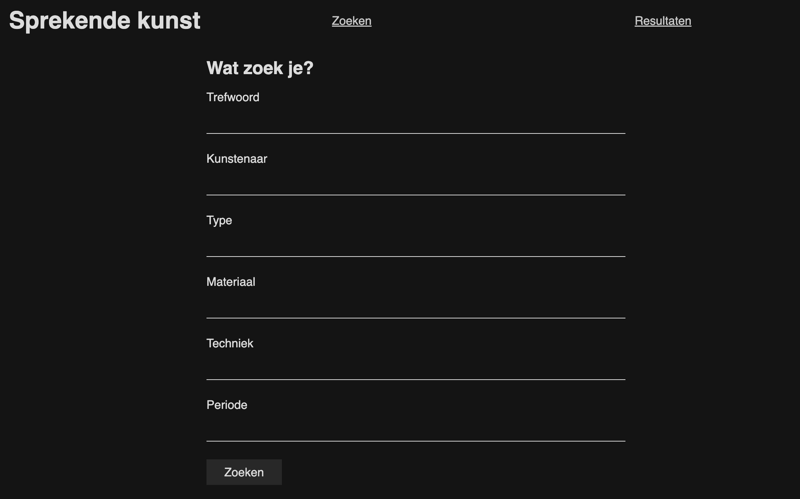
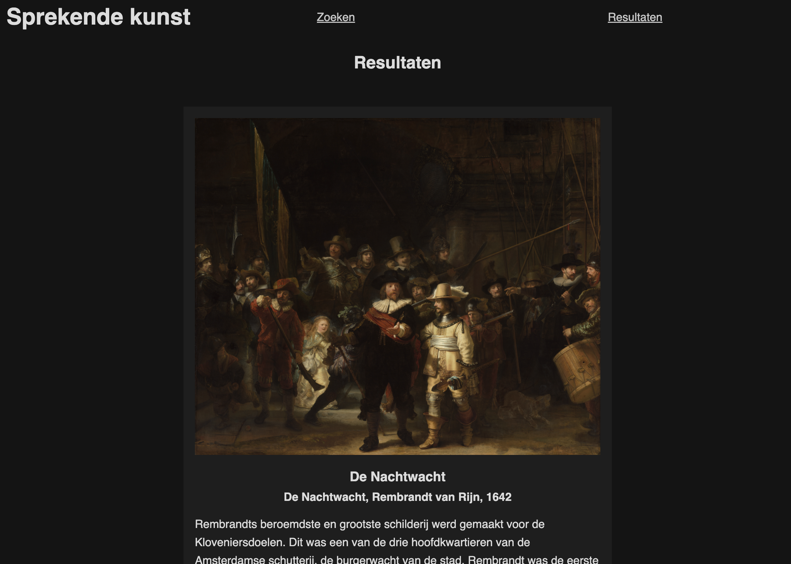
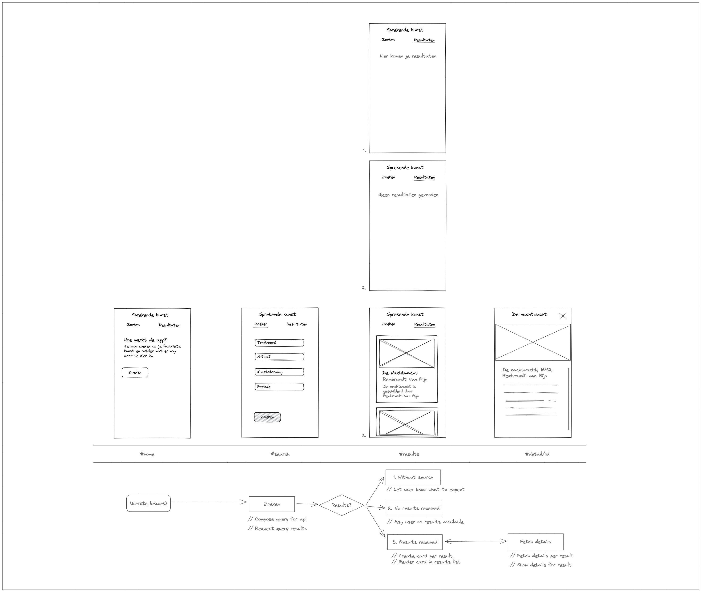

## Kai van Wezel

### Web App From Scratch

# Sprekende kunst

**Live demo** : [Sprekende Kunst](https://kaivwezel.github.io/Sprekende-kunst/)

## Description

This app uses the Rijksmuseum API to collect art for you. You can submit some keywords to search within the artcollection of Rijksmuseum. The application will then return a list of artworks that match your keywords.

## Images

Zoekpagina:

Resultatenpagina:

## Installation

To install this project, clone the repo to your machine. Navigate to the 'Rijksapp' folder. To make this work, you have to serve this folder to the client from a server. You can do this with some plugin in vscode or use other scripts on the internet.

## Features

**Detailed search**

There are a lot of keywords and categories available at the Rijksmuseum. Using the searchfields, you can pretty much acces the entire database with all its categories and filters.

**Relevance**

With the huge amount of art you can access, a long list will probably return to you. To prevent a really long scrolling adventure, the results are sorted on relevance of your keywords.

---

## Activity Diagram

## Rijksmuseum API

The data in this app is all available via the public API of the Rijksmuseum.
The [Rijksdata](https://data.rijksmuseum.nl/object-metadata/api/) organisation makes all items accessible to this app and everyone who would like to access it.
